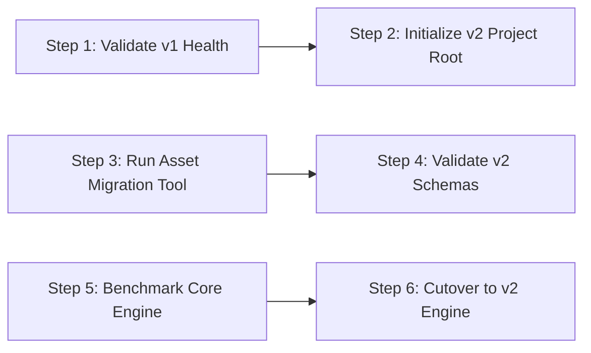

# MNE_Brain Release 2 — Migration & Compatibility Guide

> **Scope:** Independent Project Migration (`MNE_Brain_v1` ➔ `MNE_Brain_v2`)  
> **Author:** Lead DevOps Engineer & Chief AI Systems Architect  
> **Target Downtime:** ZERO DOWNTIME — 100% Backward Compatibility  

---

## 🏛️ Executive Summary & Migration Philosophy

This document defines the migration procedure for transitioning operational workloads, declarative profiles, canonical notes, and automation tasks from **`MNE_Brain_v1`** to **`MNE_Brain_v2`**.

Because `MNE_Brain_v1` exists as an independent project path (`d:/projects/MNE_Brain_v1/`) and remains frozen in maintenance mode, migration can be executed and verified iteratively without risking loss of operational state or downtime.

---

## 🛡️ Core Migration Principles

1. **Independent Workspace Isolation:** Migration copies assets from `MNE_Brain_v1` to `MNE_Brain_v2` without modifying `MNE_Brain_v1`.
2. **Backward Compatibility Shims:** `MNE_Brain_v2` includes adapter shims (`core/adapters/legacy_shim.py`) allowing Release 1 task files and profiles to run directly on the Release 2 Engine.
3. **Automated Migration Utility:** A dedicated migration script (`scripts/migrate_v1_to_v2.py`) handles schema verification and asset copying automatically.
4. **Instant Rollback:** System shortcuts and workflows can be pointed back to `d:/projects/MNE_Brain_v1/` instantly if needed.

---

## 🔄 Step-by-Step Migration Procedure



### Step 1: Validate Baseline Health in `MNE_Brain_v1`
```bash
python d:/projects/MNE_Brain_v1/scripts/validate_brain.py
```
*Requirement:* Must return `11 Benchmark Scenarios Passed & 12 / 12 Validation Checks Passed`.

---

### Step 2: Initialize Platform Workspace in `MNE_Brain_v2`
```bash
powershell -Command "New-Item -ItemType Directory -Force -Path 'd:/projects/MNE_Brain_v2/00_meta/schemas', 'd:/projects/MNE_Brain_v2/00_meta/adr', 'd:/projects/MNE_Brain_v2/core/router', 'd:/projects/MNE_Brain_v2/core/entity', 'd:/projects/MNE_Brain_v2/core/evidence', 'd:/projects/MNE_Brain_v2/core/reasoning', 'd:/projects/MNE_Brain_v2/core/policy', 'd:/projects/MNE_Brain_v2/core/verification', 'd:/projects/MNE_Brain_v2/core/lifecycle', 'd:/projects/MNE_Brain_v2/core/llm', 'd:/projects/MNE_Brain_v2/core/execution', 'd:/projects/MNE_Brain_v2/core/tools/drivers', 'd:/projects/MNE_Brain_v2/docs', 'd:/projects/MNE_Brain_v2/knowledge', 'd:/projects/MNE_Brain_v2/operations', 'd:/projects/MNE_Brain_v2/intelligence', 'd:/projects/MNE_Brain_v2/profiles', 'd:/projects/MNE_Brain_v2/tasks', 'd:/projects/MNE_Brain_v2/actions', 'd:/projects/MNE_Brain_v2/gui', 'd:/projects/MNE_Brain_v2/scripts'"
```

---

### Step 3: Run Automated Asset Migration Utility
```bash
python d:/projects/MNE_Brain_v2/scripts/migrate_v1_to_v2.py --source d:/projects/MNE_Brain_v1 --target d:/projects/MNE_Brain_v2
```

---

### Step 4: Validate Release 2 Schema Compliance
```bash
python d:/projects/MNE_Brain_v2/scripts/validate_schemas.py
```

---

### Step 5: Execute MNE_Brain Core Engine Benchmarks
```bash
python d:/projects/MNE_Brain_v2/scripts/run_benchmarks.py
```

---

### Step 6: Operational Cutover
Update CI/CD jobs and n8n webhooks to target `d:/projects/MNE_Brain_v2/scripts/run_discovery.py`.

---

## ↩️ Rollback Contingency Plan

If any issue occurs during Release 2 cutover, immediately revert trigger points to:

```bash
python d:/projects/MNE_Brain_v1/scripts/run_discovery.py
```
`MNE_Brain_v1` remains 100% frozen, functional, and intact.
